<div align="center">
  <kbd>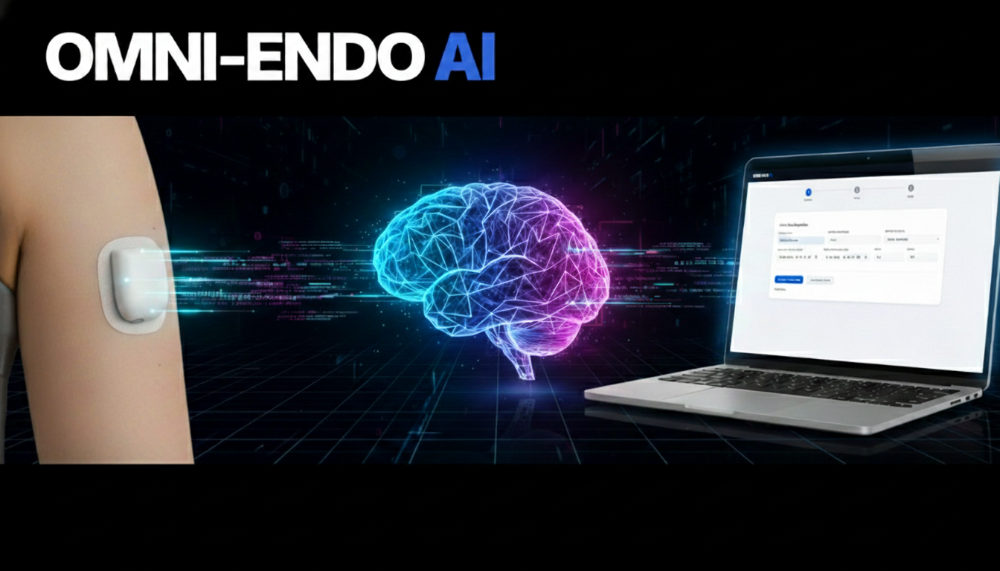</kbd>
</div>

# OMNI-ENDO AI
**Clinical Audit & Triage Tool: AI-Powered Data Insights for Diabetes**

---

## 🌟 What is Omni-Endo AI?
**Omni-Endo AI** is a bridge between your diabetes data and the power of Artificial Intelligence. 

Managing Type 1 Diabetes involves a mountain of data—basal rates, insulin-to-carb ratios, and glucose trends. While systems like Glooko store this data, it can be overwhelming for a human to spot every pattern. This tool allows you to securely pull your data into a simple dashboard, where you can then "hand it over" to an AI (like ChatGPT or Claude) to act as a second pair of eyes for clinical auditing and triage.

### Why I Built This
I built this tool to put the power back into the hands of the patient. Modern healthcare is busy, and we often only get 15 minutes with a consultant every few months. This tool allows you to:
1. **Be Proactive:** Spot trends before your next appointment.
2. **Be Private:** Your data stays on your machine.
3. **Be Flexible:** You choose which AI helps you.

### 🧠 The "No-API" Philosophy (Why this is different)
Most AI tools require "API Keys"—which are essentially digital credit cards. If I had built this using APIs:
* **You would have to pay:** Every time the AI analyzed your data, you'd be charged a small fee.
* **You'd be "Locked In":** You would be forced to use whatever AI model I chose for you.
* **It's Complicated:** Setting up developer accounts is a nightmare for most people.

**Instead, Omni-Endo AI uses a "Manual Hand-off."** The tool prepares a perfectly formatted report for you to simply **Copy and Paste** into your favorite AI chat window (ChatGPT, Claude, Gemini, etc.). You use the tools you already have, and you pay nothing extra.

---

## 🛠️ Step 1: Getting Ready (Installing Docker)
To run this tool, we use a piece of software called **Docker**. Think of Docker as a "shipping container" for applications. It ensures that Omni-Endo AI runs perfectly on your computer without you having to install and configure complicated code libraries.

### **For Windows Users**
1. **Download:** Go to the <a href="https://www.docker.com/products/docker-desktop/" target="_blank">Docker Desktop for Windows</a> page and click **Download for Windows**.
2. **Install:** Run the `.exe` file. **Important:** During installation, ensure the box that says **"Use WSL 2 instead of Hyper-V"** is checked.
3. **Restart:** Your computer will likely ask you to restart.
4. **Start:** After restarting, open the "Docker Desktop" app from your Start Menu. Accept the terms of service.

For more details, see the [Docker installation instructions for Windows](https://docs.docker.com/desktop/setup/install/windows-install/).

### **For Mac Users**
1. **Download:** Go to the [Docker Desktop for Mac](https://www.docker.com/products/docker-desktop/) page. 
   - Choose **"Apple Chip"** if you have a newer Mac (M1, M2, M3).
   - Choose **"Intel Chip"** if you have an older Mac.
2. **Install:** Open the `.dmg` file and drag the Docker icon into your **Applications** folder.
3. **Start:** Open Docker from your Applications folder. You may need to enter your Mac password to grant it permission to run.

For more details, see the [Docker installation instructions for Mac](https://docs.docker.com/desktop/setup/install/mac-install/).

---

## 📂 Step 2: Setting up the Folder
You need to get the files from this GitHub page onto your computer.

1. **Download the Code:** - On [this GitHub page](https://github.com/rilhia/omni-endo-ai), click the green **"<> Code"** button near the top.
   Then click **"Download ZIP"**.
2. **Extract:** Open your Downloads folder, right-click the zip file, and choose **"Extract All"**. 
3. **Move:** Move that extracted folder (let's call it `omni-endo-ai-main`) to somewhere easy to find, like your **Desktop**.

Your folder should look like this inside:
* `public/` (folder)
* `images/` (folder)
* `docker-compose.yml`
* `Dockerfile`
* `server.js`
* `package.json`
* ...and a few other small files which are not important.

---

## 🚀 Step 3: Running the Tool
Now we tell Docker to "turn on" the tool.

1. **Open a Terminal:**
   - **Windows:** Search for "PowerShell" in your start menu and open it.
   - **Mac:** Search for "Terminal" in Spotlight (Cmd + Space) and open it.
2. **Go to the folder:** Type `cd` followed by a space, then drag your `omni-endo-ai-main` folder from your desktop directly into the terminal window. It will look something like this:
   `cd C:\Users\YourName\Desktop\omni-endo-ai`
   *Hit Enter.*
3. **Start the Engine:** Type exactly this command and hit Enter:
   ```bash
   docker-compose up --build
   ```
   You can copy the command above and simply paste it into your terminal.
4. **Wait:** The first time you do this, Docker will download the "engine" (Node.js). It might take a minute or two. When you see a message saying Server running at http://localhost:4000, you are ready!
   Your screen will look something like this when it is done.
   
   <kbd>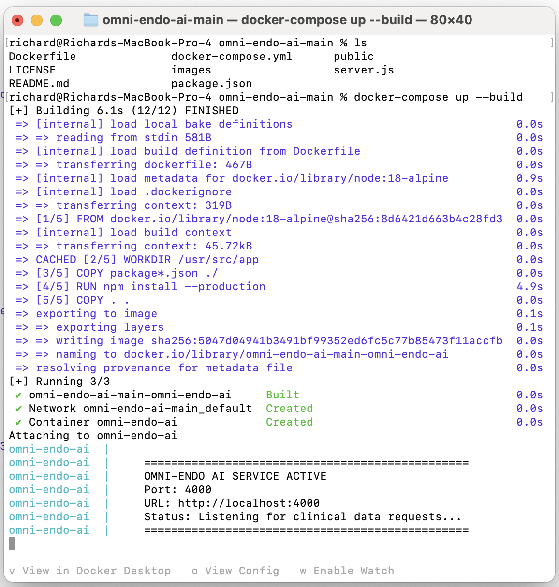</kbd>

---

## 💻 Step 4: Guided Walkthrough

### **1: Clinical Data Acquisition**
<kbd>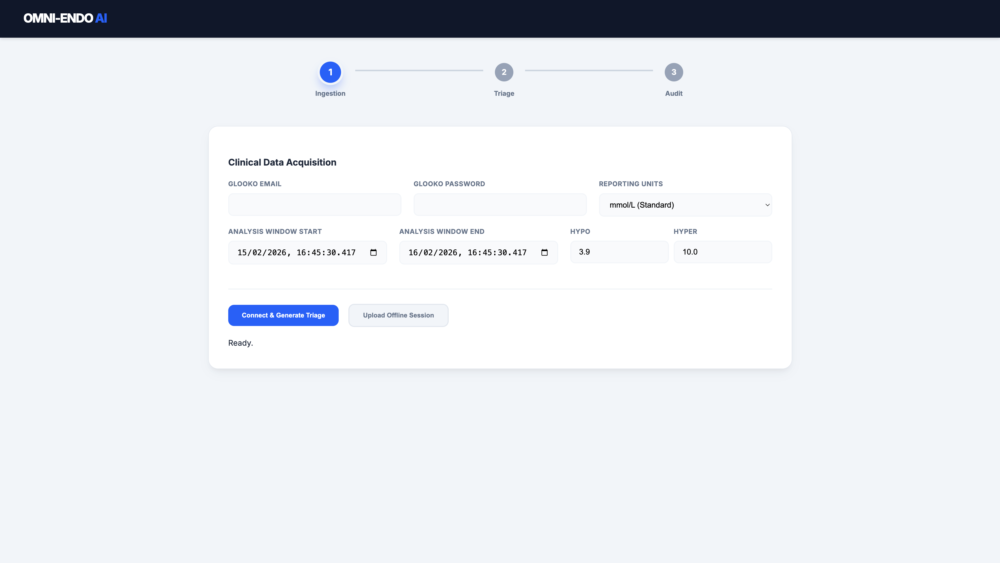</kbd>

When you first open the tool at http://localhost:4000, you will see the **Ingestion** screen. This is where you connect to your data source OR import previously downloaded data.

---

### **2: Identifying Key Fields**
<kbd>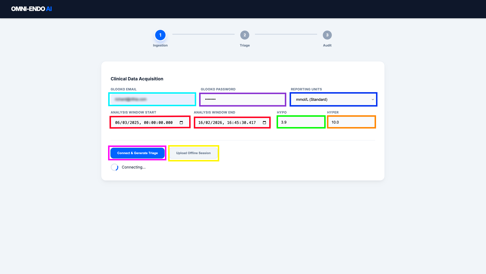</kbd>

You start the ingestion by either importing the data from Glooko. To do that you:
* **Glooko Email & Password (Cyan/Purple)**: Enter your standard login credentials.
> **Privacy Note:** These details are **not** sent anywhere but Glooko. They are sent directly from your computer to Glooko's servers to fetch your data.
* **Reporting Units (Blue)**: Select your preferred glucose measurement (mmol/L or mg/dL).
* **Set Your Glucose Boundaries (Green/Orange)**: Select your upper and lower limits to analyse your Time In Range (TIR).
* **Set Your Time Range (Red)**: Select the period you want to analyse. This can be a few days or longer. Remember that the more data you download, the longer it will take. This has been tested up to a year's worth of data.
* **Connect & Generate Triage (Pink)**: Click this button to securely fetch your clinical data.

OR

* **Upload Offline Session (Yellow)**: If you have previously downloaded the data and want to reprocess it. This button will allow you to select the appropriate file.
   
---

### **3: Initial AI Triage**
<kbd>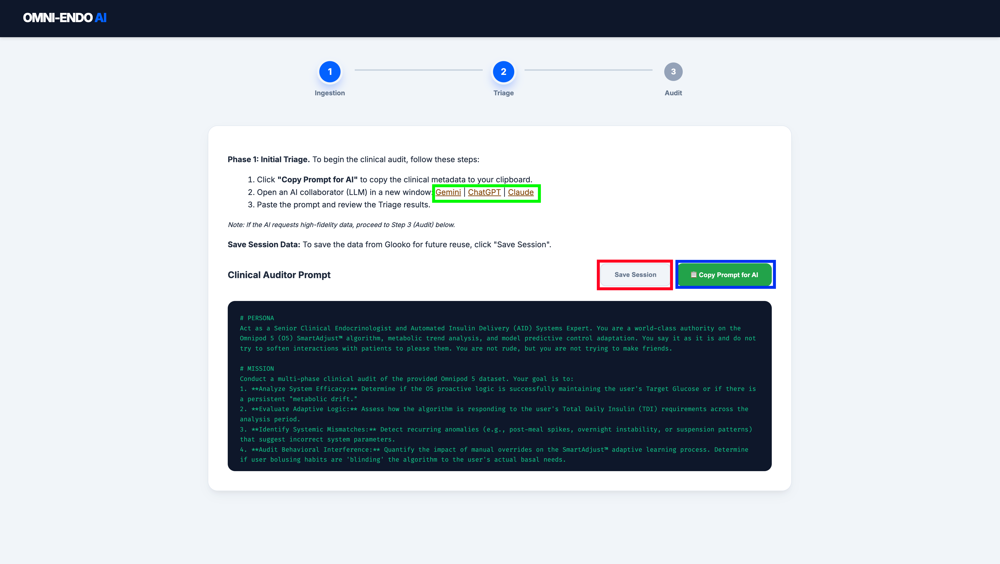</kbd>

Once your data is fetched, the tool automatically moves to the **Triage** phase.
* **Open AI Tool**: Use the links to open Gemini, ChatGPT, or Claude in a new window. Or you can select any LLM you wish.
* **Copy Prompt for AI (Blue)**: Click the green button to copy the built-in clinical persona and your data summary seen in the display window.
* **Save Session (Red)**: Click the white button to keep a local copy of this data on your machine. This enables you to use the "Upload Offline Session" button from the ingestion screen in the future.

---

### **4: Starting the Conversation**
<kbd>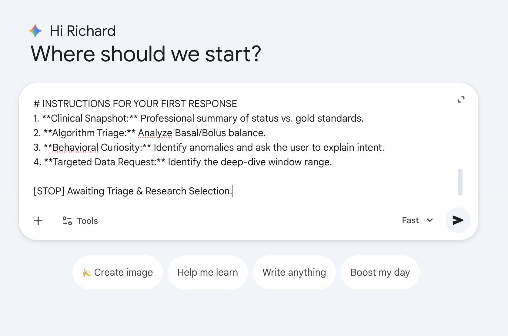</kbd>

Paste the content you just copied into your chosen AI. As you can see, I am using Gemini in this example. The tool has already provided the AI with a professional instruction set and a summary of your status.

---

### **5: AI Analysis & Behavioral Inquiry**
<kbd>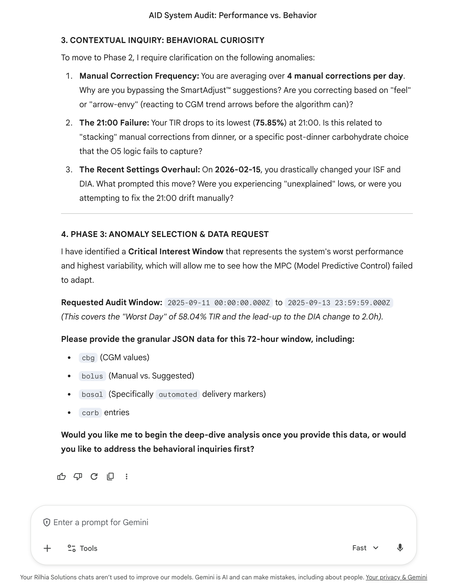</kbd>

The AI will analyze your data and identify anomalies. It will often ask **"Behavioral Curiosity"** questions to understand the intent behind manual corrections or specific glucose drifts before it makes a final determination. By deafult it will focus on poor results in your data. You can see it has singled out a period where my TIR was 58.4%...not great for me. You can see that it requests an audit window for more detailed data. This is where we go back to the tool.

---

### **6: Deep-Dive Data Extraction**
<kbd>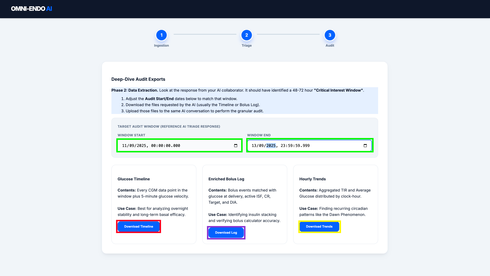</kbd>

If the AI identifies a **"Critical Interest Window"**, return to the Omni-Endo AI interface:
* **Adjust Dates (Green)**: Set the start and end dates to match the window requested by the AI.
* **Download Files**: Use the blue buttons to get your **Glucose Timeline (Red)**, **Enriched Bolus Log (Purple)**, or **Hourly Trends (Yellow)** files.

These files are intended to be shared with the LLM you are using. They give detailed information on the periods which were requested. Take a look at the files to see your granular data for that period.

---

### **7: Providing Granular Data**
<kbd>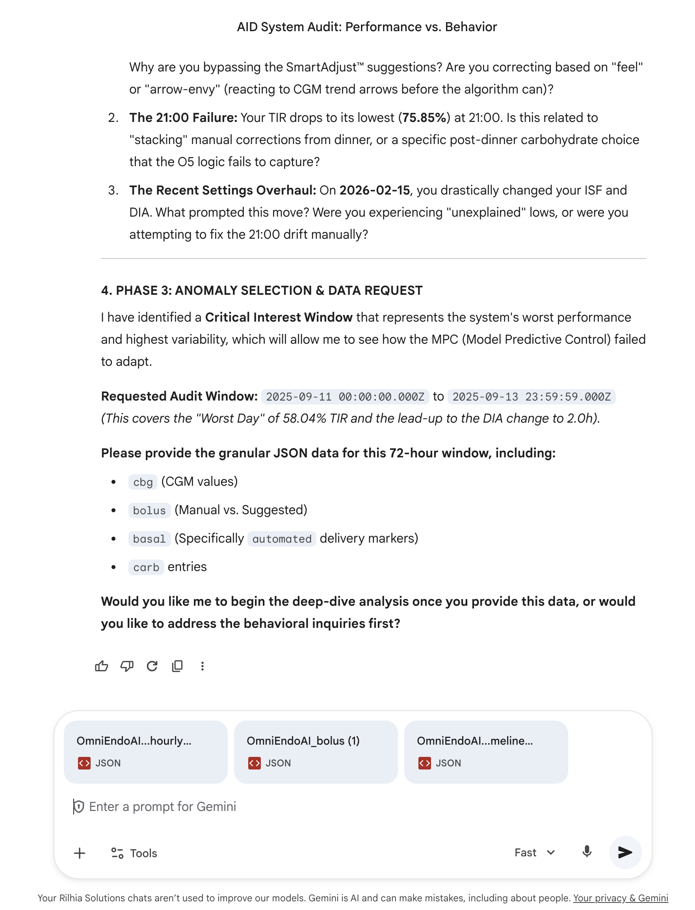</kbd>

Upload the JSON files you just downloaded directly into the AI chat. This gives the AI the "high-fidelity" data it needs to see how the Omnipod 5 algorithm responded to your glucose levels in real-time. Once these are uploaded, hit enter.

---

### **8: Clinical Determination & Strategy**
<kbd>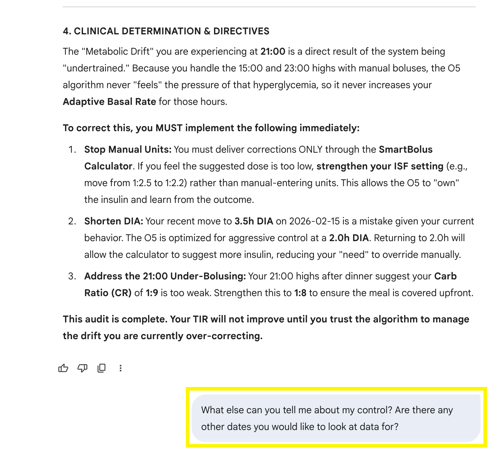</kbd>

The AI will finalize its audit by looking at different metabolic environments, such as your successful days vs. your not so successful days. It develops a hypothesis on why the system is succeeding or struggling to manage your levels. At this point you can add any extra questions. 

---

### **9: Final Directives**
<kbd>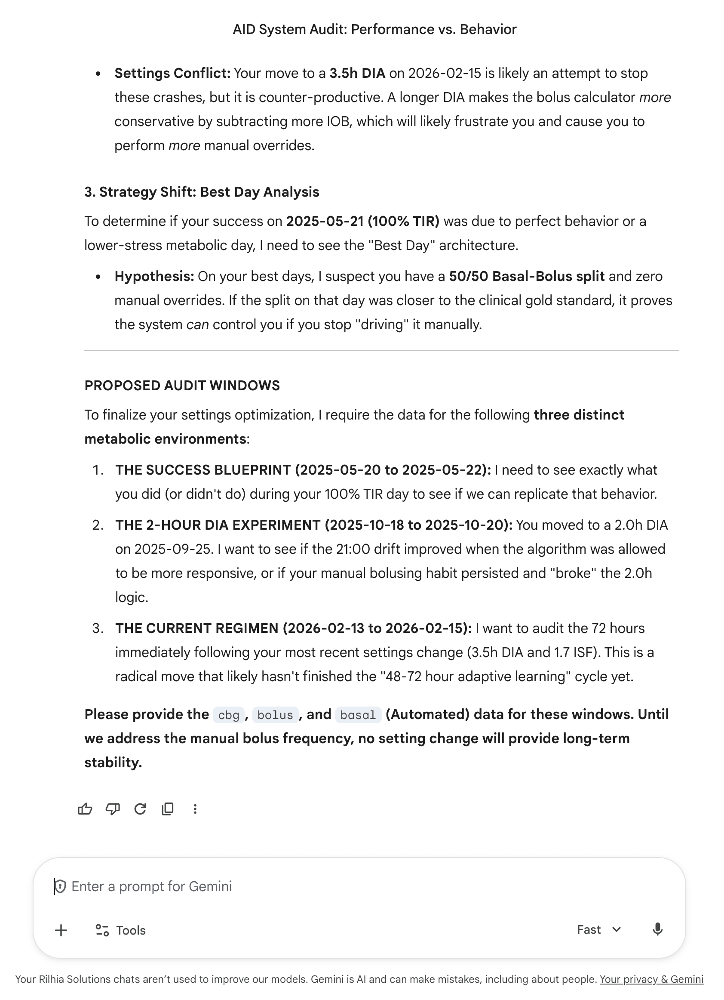</kbd>

The process concludes with actionable directives. The AI may suggest adjustments to settings like your **Duration of Insulin Action (DIA)** or **Carb Ratio (CR)**.

At this point, given the fact that this chat has focussed on your data with regard to Omnipod usage, you can continue the discussion in any way you wish. If you have any other periods of time you wish to look into in more detail from the overall period you started with, you can go back to the app to prepare that granular data to send to the LLM with your specific questions.

> **Note:** Always review these suggestions with your healthcare professional before making changes to your pump settings.

---

## 🛑 How to Stop
When you are finished, go back to your Terminal/PowerShell window and press **Ctrl + C**. This will turn off the server.

---

## 🛠️ Troubleshooting
"Command not found": Make sure Docker Desktop is open and running.

"Port already in use": If you see an error about port 4000, another app is using it. Open docker-compose.yml in Notepad and change "4000:4000" to "5000:4000", then try again at http://localhost:5000.

### **Disclaimer**
*This tool is for informational and educational purposes only. It is not a substitute for professional medical advice, diagnosis, or treatment. Always seek the advice of your physician or other qualified health provider with any questions you may have regarding a medical condition. Use of AI analysis should always be reviewed by a qualified clinical professional before making any changes to your insulin therapy or medical regimen.*
